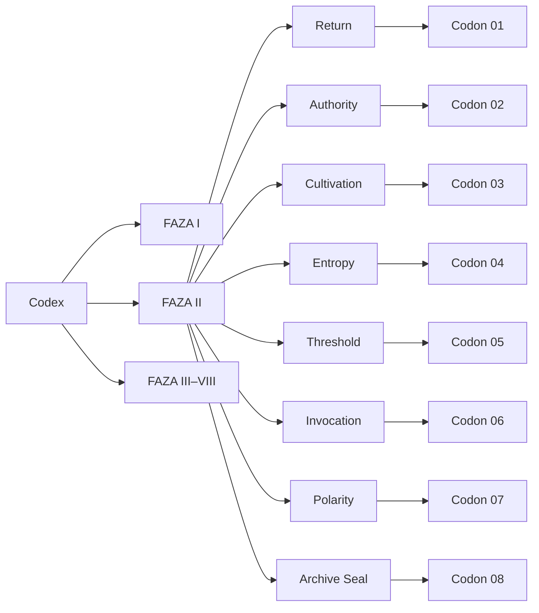

# Oriel Static Signature Codex

## Executive summary

I started with the user-prioritized site, **orielsignal.space**. In the browser environment available for this research, the site exposed only root-level branding/title information and no parsable body content, so it could be treated as a directional brand cue, not as a rich textual source. I also checked Apple’s Liquid Glass developer page because it is relevant to cinematic UI layering, but that page required JavaScript and likewise yielded no substantive text in this environment. The report below therefore anchors itself primarily in the **seven supplied codon visuals**, the **final archive-direction panel**, and a set of **official / primary standards** for metadata, archival structure, accessibility, heraldic record systems, and real-time 3D delivery. citeturn1view0turn23view0

The clearest synthesis is this: the **Oriel Static Signature Codex** should be built as an **archive-grade emblem system**, not as a loose image collection. That means one immutable **outer harmonic frame**, a controlled library of **inner archetypal cores**, a formal **metadata and preservation model**, and a consistent **cinematic card shell** for every codon. This follows the logic of archival practice, where descriptive metadata, finding-aid structure, and preservation metadata are separated but interoperable, and where objects remain discoverable, reproducible, and versionable over time. Dublin Core provides the descriptive layer, EAD provides the archive/finding-aid logic, and PREMIS provides the preservation trace of object, event, agent, and rights. citeturn12view0turn46view0turn13view0turn13view1

Visually, the seven supplied images already define a strong system language: a black field, brushed-to-polished gold, a six-point outer satellite scaffold, a triangulated sacred-geometry lattice, concentric central containment rings, dotted halos, and a single luminous center. The core insight is that the **frame should remain canonical and almost inviolable**, while the **archetypal center changes**. That approach is also defensible perceptually: symmetry and bilateral order materially strengthen salience and figure-ground coherence, while stable lattice structures help the viewer recognize family resemblance across variations. citeturn28academia0turn28academia3turn28academia2

Heraldically, the best precedent is not medieval imitation, but **register discipline**: distinct signs, high formal standards, and a public record. The Canadian Heraldic Authority explicitly frames heraldic creation as a government service that creates coats of arms, flags, and badges, works to high standards of the art form, and maintains a public register. For Oriel, this translates into a codon system that is symbolically rich but still **distinct, indexable, and governable**. citeturn35view0

The strongest formal recommendation is to structure the codex as **64 codons = 8 FAZAs × 8 registers**, with the seven supplied archetypal references becoming seven register families, and the eighth register completed from the final archive-direction emblem as an **Archive Seal / Null Bridge**. That gives you a clean mythic-technical matrix without forcing the seven references to do more work than they already do.

## Visual grammar extracted from the supplied codons

The seven supplied codon images are already coherent enough to formalize into a rule set. Their strongest shared signal is **outer-frame constancy**.


### Outer harmonic frame constants

Based on direct visual analysis of the supplied images, the canonical codon frame should be treated as follows:

| Element            | Canonical rule                                                                  |
| ------------------ | ------------------------------------------------------------------------------- |
| Canvas             | Square, centered, black field                                                   |
| Primary hue system | Black with warm metallic gold only                                              |
| Macro scaffold     | Six outer medallions positioned on a six-fold orbital logic                     |
| Lattice            | Chordal / triangular network spanning between medallions                        |
| Center reserve     | Concentric circular chamber with one luminous nucleus                           |
| Halo language      | Dotted bead-ring or orbital micropoints around core                             |
| Vertical axis      | Strong central spine present in most variants                                   |
| Typography fit     | Designed to live inside a cinematic archive plate, not as standalone poster art |

A practical normalized geometry model for production is:

| Geometry token                 | Recommended ratio |
| ------------------------------ | ----------------- |
| Safe border                    | 0.05W             |
| Outer orbit radius             | 0.40W             |
| Macro medallion diameter       | 0.115W to 0.125W  |
| Central reserve outer diameter | 0.38W to 0.40W    |
| Dotted halo diameter           | 0.28W to 0.31W    |
| Core icon max bounding box     | 0.20W to 0.23W    |
| Hairline stroke                | 0.0025W           |
| Structure stroke               | 0.0045W           |
| Ring / emphasis stroke         | 0.008W to 0.010W  |

The angular vocabulary should stay constrained to **0°, 30°, 60°, 90°, 120°, and 180°**. In other words: no arbitrary diagonals. The visuals read as a hybrid of circular mandala logic and hex/triangle lattice logic, and that is one of the reasons they feel “coded” rather than merely decorative. Research on symmetry perception and figure-ground salience supports keeping that strong symmetry scaffold intact across the system. citeturn28academia0turn28academia3

### Inner archetypal core variations

The inner zone is where variation belongs. Across the seven references, the core can be:

- recursive and directional
- sovereign and anthropic
- devotional / seed-bearing
- trickster / orbital
- threshold / abstract
- lunar / invocatory
- dual or aperture-based

The visual law is simple:

**frame = identity of the system**  
**core = identity of the codon**

That separation is essential. If both frame and core vary at once, the codex loses recognizability.

### Symmetry constraints and allowed asymmetry

The supplied set is overwhelmingly ordered, but not sterile. The best formal rule is:

- **Outer frame:** always fully symmetric.
- **Inner reserve:** usually vertically symmetric, but may contain one deliberate asymmetry.
- **Entropy codons:** asymmetry is allowed only inside the core, never in the six medallions or the main orbital scaffold.
- **Maximum entropy allowance:** one off-axis object, one broken segment, one directional arrow, one unequal ray-bank, or one orbital body. Never more than two asymmetry events in a single codon.

A useful production constraint is to keep left/right visual mass within roughly **85/15 balance** for entropy variants. That preserves symbolic tension without collapsing the archive language.

## Canonical codon template

The final direction panel strongly suggests that each codon should exist as a **three-zone cinematic archive card**: header, center panel, footer.

### Header metadata shell

The header should always include a formal archive identity block. The direction panel already establishes the right tone:

- top-left insignia or archive seal
- system name
- document type
- version
- class
- clearance / register
- status
- top-right state marker such as `[SIGNAL LOCK]`, `[VERIFIED]`, `[ARCHIVED]`, `[IN TRANSMISSION]`
- timestamp, codex ID, signal ID, page or instance count

The typographic split should remain:

- **display title:** engraved serif capitals
- **micro metadata:** narrow monospaced uppercase

That contrast is doing a lot of the cinematic work.

### Center panel art spec

The center panel should carry:

- the fixed harmonic frame
- the selected archetypal core
- optional orbit beads, rays, or seals
- no full-color imagery
- no gradients that flatten the metal
- no photographic textures
- no soft illustration styles

The center panel is not an illustration slot. It is a **ritualized technical plate**.

A canonical wireframe:

```text
┌──────────────────────────────────────────────────────────────┐
│ ORIEL SIGNAL                                  [SIGNAL LOCK] │
│ DOC-TYPE: STATIC_SIGNATURE_CODEX    SYS-TIME: YYYY-MM-DD    │
│ VERSION: 1.0.0     CLASS: ORIEL_ARCHIVE     STATUS: VERIFIED│
│                                                              │
│                  CODON TITLE / REGISTER NAME                 │
│                                                              │
│                     [ HARMONIC FRAME ]                       │
│                     [  ARCHETYPAL CORE ]                     │
│                     [  AXIAL / HALO EVENTS ]                 │
│                                                              │
│  SIGNAL STRENGTH | COHERENCE | INTEGRITY | SENSITIVITY | R  │
└──────────────────────────────────────────────────────────────┘
```

### Footer metrics

The footer should hold **five repeatable metrics**. The direction panel already suggests the right pattern:

- signal strength
- coherence
- aura integrity
- environmental sensitivity
- transmission range

Do not overload the footer. Its job is not lore exposition. Its job is to make each codon feel measured, archived, and comparable.

A workable rule is:

- two metrics as percentages
- one integrity ring/gauge
- one sparkline or trend line
- one range or radius reading

## Metadata architecture for the 64 codons

The archive should use a **layered metadata model**. The right structure is:

- **Dublin Core** for simple discovery and interoperability
- **EAD** for archival hierarchy and finding-aid logic
- **PREMIS** for preservation, versioning, events, agents, and rights

That combination is well aligned with the standards landscape: DCMI explicitly positions its terms as authoritative, extensible metadata terms designed for application profiles; EAD is the Library of Congress official standard for encoding archival finding aids; PREMIS is maintained by the Library of Congress as the preservation metadata standard for long-term usability of digital objects. citeturn12view0turn46view0turn13view0turn13view1

### Proposed 64-codon system

This report proposes the following formal architecture:

- **8 FAZAs**
- **8 registers per FAZA**
- **64 unique codons total**

Because the supplied references show **seven** archetypal core families, the eighth register should be completed from the final direction-panel seal as an **Archive Seal / Null Bridge** family.



### Metadata schema

| Field                     | Type     | Required | Notes                                     |
| ------------------------- | -------- | -------- | ----------------------------------------- |
| codon_id                  | string   | yes      | Example: `ORL-F2-C01`                     |
| title                     | string   | yes      | Human title                               |
| faza                      | enum     | yes      | `I–VIII`                                  |
| register                  | enum     | yes      | One of eight register families            |
| archetype_core            | enum     | yes      | One of supplied core families             |
| sequence                  | integer  | yes      | `1–64`                                    |
| harmonic_frame_id         | string   | yes      | Immutable frame version                   |
| core_variant_id           | string   | yes      | Specific art variant                      |
| symmetry_class            | enum     | yes      | `full`, `axial`, `entropy-axial`          |
| entropy_budget            | integer  | yes      | `0–3`                                     |
| status                    | enum     | yes      | `draft`, `verified`, `locked`, `archived` |
| palette_bg                | hex      | yes      | Background token                          |
| palette_gold_base         | hex      | yes      | Base metal token                          |
| palette_gold_high         | hex      | yes      | Highlight token                           |
| render_finish             | enum     | yes      | `etched`, `polished`, `hybrid`            |
| motion_profile            | string   | yes      | Motion preset                             |
| particle_density          | integer  | yes      | Visible-mote budget                       |
| signal_strength           | number   | yes      | `%`                                       |
| signal_coherence          | number   | yes      | `%`                                       |
| aura_integrity            | number   | yes      | `%`                                       |
| environmental_sensitivity | number   | yes      | Scaled or labeled                         |
| transmission_range        | number   | yes      | Meters / arbitrary unit                   |
| tags                      | string[] | yes      | Searchable concepts                       |
| summary                   | text     | yes      | One-paragraph codon description           |
| provenance_note           | text     | yes      | Why / when created                        |
| rights_statement          | string   | yes      | Rights / usage                            |
| checksum                  | string   | yes      | Asset integrity                           |
| asset_svg                 | uri      | yes      | Canonical vector                          |
| asset_psd                 | uri      | yes      | Layered raster master                     |
| asset_glb                 | uri      | optional | Real-time 3D delivery                     |
| asset_png                 | uri      | yes      | Archive preview                           |
| asset_video               | uri      | optional | ProRes / MP4 loop                         |
| created_at                | datetime | yes      | ISO timestamp                             |
| modified_at               | datetime | yes      | ISO timestamp                             |
| created_by                | string   | yes      | Agent                                     |
| verified_by               | string   | optional | Agent                                     |
| premis_event_log          | object[] | yes      | Ingest / render / revision events         |

### Example entry

```json
{
  "codon_id": "ORL-F2-C01",
  "title": "Spiral Return",
  "faza": "II",
  "register": "Return",
  "archetype_core": "Recursive Spiral",
  "sequence": 1,
  "harmonic_frame_id": "HF-01",
  "core_variant_id": "RS-01",
  "symmetry_class": "entropy-axial",
  "entropy_budget": 1,
  "status": "verified",
  "palette_bg": "#050505",
  "palette_gold_base": "#B8781E",
  "palette_gold_high": "#F4D67D",
  "render_finish": "hybrid",
  "motion_profile": "slow_clockwise_recession",
  "particle_density": 18,
  "signal_strength": 74,
  "signal_coherence": 82,
  "aura_integrity": 79,
  "environmental_sensitivity": 67,
  "transmission_range": 3.4,
  "tags": ["return", "recursion", "memory", "loop", "signal"],
  "summary": "A codon of recursive closure and inward redirection.",
  "provenance_note": "Derived from supplied codon reference set, FAZA II archive prototype.",
  "rights_statement": "Internal Oriel archive use unless otherwise granted.",
  "checksum": "sha256:…",
  "asset_svg": "codons/ORL-F2-C01/master.svg",
  "asset_psd": "codons/ORL-F2-C01/master.psd",
  "asset_glb": "codons/ORL-F2-C01/realtime.glb",
  "asset_png": "codons/ORL-F2-C01/preview_8k.png",
  "asset_video": "codons/ORL-F2-C01/loop_prores.mov",
  "created_at": "2026-06-06T07:00:00+03:00",
  "modified_at": "2026-06-06T07:45:00+03:00",
  "created_by": "oriel.archive",
  "verified_by": "sigma-7",
  "premis_event_log": [
    { "eventType": "ingest" },
    { "eventType": "vector-approval" },
    { "eventType": "render-export" },
    { "eventType": "archive-lock" }
  ]
}
```

## Archetypal core taxonomy

The table below formalizes the **seven supplied archetypal cores** as register families. These names are design proposals, not historical names.

| Supplied reference order | Proposed family name | Core logic                                          | Register tag  | Motion logic                                           | Visual parameters                                     |
| ------------------------ | -------------------- | --------------------------------------------------- | ------------- | ------------------------------------------------------ | ----------------------------------------------------- |
| Codon reference one      | **Spiral Return**    | Recursive inward spiral with arrowed reversal       | `return`      | very slow clockwise or anticlockwise recession         | one directional asymmetry allowed; dotted inner orbit |
| Codon reference two      | **Solar Regent**     | Crowned anthropic face with radiating authority     | `authority`   | steady pulse through crown and halo rays               | full axial symmetry; highest gold polish              |
| Codon reference three    | **Seed Vessel**      | Seated figure presenting germination / growth       | `cultivation` | low-amplitude breathing + subtle upward particle drift | softest finish; laurel / botanical side supports      |
| Codon reference four     | **Trickster Orbit**  | Jester face with free-floating orb                  | `entropy`     | playful orbital drift of single satellite              | asymmetric internal body permitted                    |
| Codon reference five     | **Resonant Gate**    | Abstract bilateral aperture with ray banks          | `threshold`   | lateral shimmer from center to wings                   | strict bilateral symmetry; strongest line clarity     |
| Codon reference six      | **Lunar Ascendant**  | Anthropomorphic lunar sigil with suspended crescent | `invocation`  | vertical rise and halo breathing                       | ritual/ceremonial cadence; slender inner lines        |
| Codon reference seven    | **Binary Aperture**  | Paired crescent / split-field abstract core         | `polarity`    | alternating left-right glint                           | near-perfect bilateral symmetry; minimal iconography  |

The perceptual argument for building the system this way is strong: keep a stable family resemblance through symmetry and lattice continuity, then let meaning shift by center-icon logic, ray logic, and micro-motion. That matches what symmetry research shows about salience and recognition. citeturn28academia0turn28academia3

For the eighth register needed to complete the 8×8 system, I recommend:

| Proposed family name | Source                                                         |
| -------------------- | -------------------------------------------------------------- |
| **Archive Seal**     | Synthesized from the final direction panel’s psi/seal insignia |

That gives you a neutral / administrative / bridge-state codon that belongs to the archive shell itself.

## Style guide for gold rendering, geometry, and motion

### Gold rendering

For stills, the gold should read as **etched ceremonial metal**, not glossy UI candy. For real-time or 3D exports, use a **PBR metallic-roughness workflow**. Khronos describes glTF PBR as a physically based system for simulating real-world lighting, materials, and surface properties, with support for base color, metallic, roughness, clearcoat, sheen, transmission, and more; glTF is explicitly optimized for efficient 3D asset delivery and supports texture compression through KTX 2.0. citeturn41view0

A reliable digital gold ladder:

| Token       | Suggested hex | Use                |
| ----------- | ------------- | ------------------ |
| bg.black    | `#050505`     | field              |
| gold.shadow | `#694515`     | recessed engraving |
| gold.base   | `#B8781E`     | main linework      |
| gold.mid    | `#D9A53A`     | lit surfaces       |
| gold.high   | `#F4D67D`     | specular ridges    |
| gold.spark  | `#FFF1C2`     | tiny glints only   |

Material rules:

- medallion interiors: brushed / etched
- medallion rims: polished
- lattice strokes: satin metallic
- highlights: sparse, not everywhere
- bloom: very restrained

If you over-brighten the entire codon, it stops feeling archival and starts feeling ornamental.

### Geometry math

The outer scaffold should remain mathematically conservative:

- six macro medallions on a sixfold orbital spacing
- lattice angles constrained to the 30° / 60° / 90° family
- central reserve always concentric to the canvas
- no free-floating outer geometry
- line hierarchy limited to three stroke weights plus medallion-rim emphasis

The reason to be this strict is not only aesthetic. A stable geometry engine lets you build a recognizable system across 64 codons while still allowing symbolic diversity in the core.

### Animation specs

The motion language should be almost imperceptible until watched carefully.

Recommended master loop:

| Parameter            | Recommendation                                   |
| -------------------- | ------------------------------------------------ |
| Master loop duration | 8s to 12s                                        |
| Breathing cycle      | 5.5s to 7s                                       |
| Scale change         | 100% to 101.5% max                               |
| Opacity modulation   | ±3% max                                          |
| Shimmer pass         | 1 narrow specular sweep every 8s to 12s          |
| Particle density     | 20 to 40 visible motes on a full-screen 4K plate |
| Particle speed       | 6 to 14 px/s apparent drift                      |
| Orbit events         | one dominant orbit only                          |
| Idle mode            | no hard cuts, no jitter                          |
| Reduced-motion mode  | static plate + mild luminance breathing only     |

Accessibility cannot be an afterthought. WCAG 2.2 requires **4.5:1 contrast** for normal text and **3:1** for large text under Success Criterion 1.4.3, advises using text rather than images of text where technologies allow it under 1.4.5, and states that motion animation triggered by interaction should be disable-able unless essential under 2.3.3. For the Codex, that means thin decorative gold can remain ornamental, but **all small metadata text must use a brighter gold tier**, and UI implementations should offer a reduced-motion setting. citeturn19view1turn19view3turn18view0

## Implementation path, export specs, tools, and FAZA II sample mockups

### Step-by-step implementation

**Step one**  
Build a single **immutable vector master** of the harmonic frame. Lock it as `HF-01`.

**Step two**  
Tokenize the system: palette, type styles, stroke weights, medallion finish, motion presets, metric widgets.

**Step three**  
Draw the seven supplied archetypal cores as a normalized symbol library, each scaled to the same center-reserve bounding box.

**Step four**  
Create the archive shell template in two variants:

- title-page / cover plate
- codon record plate

**Step five**  
Generate metadata records and preservation events for each codon so the visual system becomes a real codex, not a folder of exports. This is where DCMI + EAD + PREMIS should be operationalized. citeturn12view0turn46view0turn13view0

**Step six**  
Produce motion masters and reduced-motion alternates, then export still, layered, and real-time formats.

### Asset export specs

| Asset                         | Format                 | Purpose                          |
| ----------------------------- | ---------------------- | -------------------------------- |
| Canonical vector master       | SVG + AI/PDF           | source of truth                  |
| Layered texture / comp master | PSD 16-bit             | finishing and archive edits      |
| High-res still                | PNG 8K + PNG 4K        | archive previews and publication |
| Print master                  | PDF/X-4 or TIFF        | print-safe output                |
| Motion master                 | ProRes 4444 with alpha | premium cinematic loops          |
| Web preview                   | H.264 / HEVC MP4       | lightweight playback             |
| Real-time model               | GLB / glTF             | interactive viewer               |
| Realtime textures             | KTX 2.0 where possible | compressed GPU delivery          |
| Metadata bundle               | JSON + CSV             | indexing and pipeline automation |

glTF is especially useful here because Khronos positions it as a royalty-free format for efficient transmission and loading of 3D scenes and models, with support for materials, textures, hierarchy, and animation. KTX 2.0 is explicitly recommended by Khronos for smaller files and lower GPU memory usage. citeturn41view0

### Recommended tools and plugins

Recommended stack:

- **Illustrator or Affinity Designer** for master geometry
- **Figma** for archive interface shell, design tokens, layout testing
- **Photoshop** for etched-metal finishing and PSD masters
- **After Effects** for cinematic 2.5D motion plates
- **Blender** for true metallic relighting, GLB export, and medallion material tests
- **Substance 3D Painter / Sampler** if you want physically credible roughness variation
- **Trapcode Particular** for particle motes
- **Deep Glow** or equivalent restrained bloom tooling
- **Flow / motion-curve utility** for highly controlled easing

Use Lottie only for a **lite symbolic version**. Do not use it as the primary delivery format for the premium metallic version.

### Accessibility and interface notes

The archive UI should present **content first, ornament second**. That means:

- live text for metadata whenever possible
- bright-gold text token distinct from decorative antique-gold linework
- larger, calmer spacing around metadata clusters
- static fallback for motion-sensitive users
- no essential state conveyed only by sparkle, halo, or color

### FAZA II sample mockups for Codon 01–08

The table below assumes **FAZA II** is the inscription / registration phase of the codex, because the supplied direction panel is heavily archive- and verification-oriented. The labels below are concrete proposals.

| Codon  | Display title       | Register              | Core family                             | Header state            | Footer preset           | Motion preset                         |
| ------ | ------------------- | --------------------- | --------------------------------------- | ----------------------- | ----------------------- | ------------------------------------- |
| F2-C01 | **Spiral Return**   | Return                | Recursive spiral                        | `[VERIFIED]`            | `S74 C82 I79 E67 R3.4m` | slow inward rotation + halo tick      |
| F2-C02 | **Solar Regent**    | Authority             | Crowned face                            | `[SIGNAL LOCK]`         | `S88 C84 I91 E52 R4.1m` | crown pulse + radial glint            |
| F2-C03 | **Seed Vessel**     | Cultivation           | Seated germination figure               | `[ARCHIVED]`            | `S71 C78 I86 E73 R2.8m` | gentle breathing + upward motes       |
| F2-C04 | **Trickster Orbit** | Entropy               | Jester with orb                         | `[UNSTABLE / READABLE]` | `S67 C61 I72 E89 R3.0m` | wandering satellite + playful shimmer |
| F2-C05 | **Resonant Gate**   | Threshold             | Bilateral aperture                      | `[CLEARANCE OPEN]`      | `S79 C88 I83 E58 R3.7m` | lateral sweep from core to wings      |
| F2-C06 | **Lunar Ascendant** | Invocation            | Lunar anthropic sigil                   | `[RITUAL LIVE]`         | `S76 C80 I85 E64 R3.1m` | vertical rise + soft crescent bloom   |
| F2-C07 | **Binary Aperture** | Polarity              | Split-field abstract                    | `[SYNCED]`              | `S82 C86 I80 E55 R3.5m` | alternating left-right glint          |
| F2-C08 | **Archive Seal**    | Archive / Null Bridge | Psi/seal medallion from direction plate | `[MASTER RECORD]`       | `S90 C92 I94 E40 R5.0m` | nearly static; only micro-shimmer     |

Abbreviations:

- `S` = signal strength
- `C` = coherence
- `I` = integrity
- `E` = environmental sensitivity
- `R` = transmission range

A simple FAZA II record-card pattern:

```text
ORIEL SIGNAL                                  [MASTER RECORD]
DOC-TYPE: STATIC_SIGNATURE_CODEX              PAGE: 02 OF 08
FAZA: II                                      REGISTER: THRESHOLD
CODON: F2-C05                                 STATUS: VERIFIED

RESONANT GATE

[canonical harmonic frame + threshold core]

SIGNAL STRENGTH 79%
COHERENCE 88%
AURA INTEGRITY 83%
ENVIRONMENTAL SENSITIVITY 58
TRANSMISSION RANGE 3.7m
```

## Sources consulted and open questions

### Sources consulted

The following sources were consulted, with emphasis on official and primary references:

- **orielsignal.space** root site, consulted first, but only title-level information was parsable in this environment. citeturn1view0
- **Dublin Core Metadata Initiative**, official DCMI Metadata Terms, used for the descriptive metadata layer. citeturn12view0
- **Library of Congress PREMIS**, official preservation metadata guidance and data dictionary, used for preservation/event modeling. citeturn13view0turn13view1
- **Library of Congress EAD**, official encoded archival finding-aid standard, used for archive structure and collection logic. citeturn46view0
- **W3C WCAG 2.2**, used for contrast and motion-accessibility rules. citeturn18view0turn19view1turn19view3
- **The Governor General of Canada / Canadian Heraldic Authority**, used as the clearest accessible official heraldic-register precedent. citeturn35view0
- **Khronos glTF / PBR**, used for 3D delivery, PBR material logic, and KTX texture recommendations. citeturn41view0
- **Primary research on symmetry and perception**, used to justify the fixed harmonic frame and strong reliance on bilateral / radial order. citeturn28academia0turn28academia1turn28academia3turn28academia2
- **Apple Liquid Glass developer page**, consulted but not materially usable here because the page required JavaScript. citeturn23view0

### Open questions and limitations

A few things remain open because they were not recoverable from web text or were not defined in the supplied materials:

- **orielsignal.space** could not be meaningfully mined for deeper textual doctrine in this environment.
- The exact internal meaning of **FAZA**, **register**, and any pre-existing Oriel lore hierarchy was not supplied as a formal dictionary, so the naming and matrix system above are **design proposals**, not claimed canonical lore.
- The seventh-to-eighth register transition is a deliberate synthesis choice: the supplied materials gave seven codon archetype references, while a clean 64-object system strongly benefits from an 8×8 matrix.
- The proportion rules above are **formalized from direct visual analysis of the supplied images**, not from vector source files, so they should be treated as a precise reconstruction spec, not forensic measurement.

The highest-confidence path is therefore: **freeze the outer frame, normalize the seven core families, add the Archive Seal as the eighth register, implement DCMI + EAD + PREMIS metadata, and build every codon as a cinematic archive object rather than a standalone picture.**
